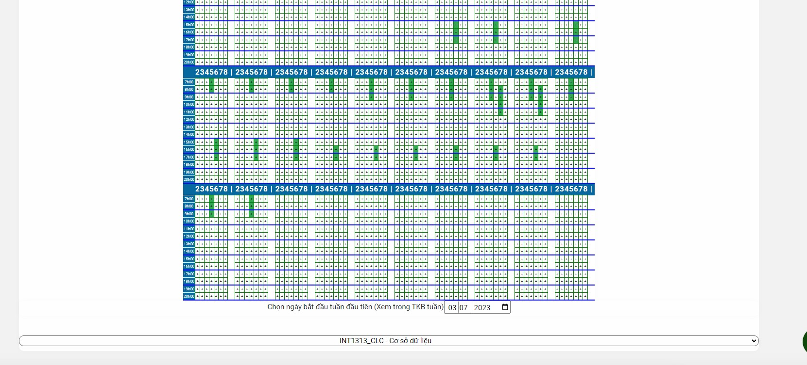

# QLDT Enhancer (Beta Branch)
# Nhánh này thường có nhiều lỗi hơn, dù nhánh chính vẫn đã rất bug. 

## Author

* quochungcyou
* Idea khởi nguồn và code tham khảo từ anh Khoa (https://github.com/28dec/qldt_prepare_schedule). Người đã tạo ra tool miễn phí cho các thế hệ sinh viên ptit sử dụng rất nhiều năm


## Description

* Script hỗ trợ việc xếp lịch TKB, đồng thời chỉnh lại giao diện QLDT một chút theo ý mình. Script được hoàn thành gấp rút trong nửa ngày vì yêu cầu của bạn bè mình, mình cũng chỉ mới học JavaScript nên nếu có lỗi hay vấn đề hi vọng các bạn có thể liên hệ mình qua nguyenquochung.workvn@gmail.com

* Sử dụng script theo nhu cầu của bạn, mình không chịu trách nhiệm trước các vấn đề liên quan đến việc sử dụng script này.


## Feature
- [x] Tool xem xếp lịch TKB theo QLDT
- [x] Chọn môn bằng dropdown nhanh chóng, đỡ phải tìm kiếm hay lướt như QLDT cũ
- [x] Tự động cập nhật lịch thay đổi
- [x] Chỉnh sửa giao diện thêm một chút
- [x] Tự động giữ kết nối, tránh bị out session


## Prerequisites and Setup

* Để sử dụng, đầu tiên bạn cần tải Tamper Monkey về trình duyệt của bạn, sau đó tải script về và cài đặt. (https://chrome.google.com/webstore/detail/tampermonkey/dhdgffkkebhmkfjojejmpbldmpobfkfo?hl=vi)
* Sau đó vào link sau để tiến hành cài đặt (https://raw.githubusercontent.com/quochung-cyou/QLDT_Enhancer/beta/code.user.js)
* Truy cập QLDT -> Xem thời khoá biểu tuần -> Lấy ngày tháng năm của kì chuẩn bị học. Ví dụ 03/08/2023
* Truy cập QLDT -> Đăng ký môn -> Đăng ký môn học theo CTDT kế hoạch
* Ấn nút trắng góc dưới bên phải màn hình để bật script
* Điền ngày tháng đã lấy ở bước trên, rồi tick các box môn học để theo dõi lịch thay đổi


## Technologies Used

* JavaScript
* JQuery


## Demo image





## License Information

* This software is licensed under MIT License.
* [Read More](https://choosealicense.com/licenses/mit/) on the license.


```
MIT License

Copyright (c) 2023 QuocHung

Permission is hereby granted, free of charge, to any person obtaining a copy
of this software and associated documentation files (the "Software"), to deal
in the Software without restriction, including without limitation the rights
to use, copy, modify, merge, publish, distribute, sublicense, and/or sell
copies of the Software, and to permit persons to whom the Software is
furnished to do so, subject to the following conditions:

The above copyright notice and this permission notice shall be included in all
copies or substantial portions of the Software.

THE SOFTWARE IS PROVIDED "AS IS", WITHOUT WARRANTY OF ANY KIND, EXPRESS OR
IMPLIED, INCLUDING BUT NOT LIMITED TO THE WARRANTIES OF MERCHANTABILITY,
FITNESS FOR A PARTICULAR PURPOSE AND NONINFRINGEMENT. IN NO EVENT SHALL THE
AUTHORS OR COPYRIGHT HOLDERS BE LIABLE FOR ANY CLAIM, DAMAGES OR OTHER
LIABILITY, WHETHER IN AN ACTION OF CONTRACT, TORT OR OTHERWISE, ARISING FROM,
OUT OF OR IN CONNECTION WITH THE SOFTWARE OR THE USE OR OTHER DEALINGS IN THE
SOFTWARE.
```
